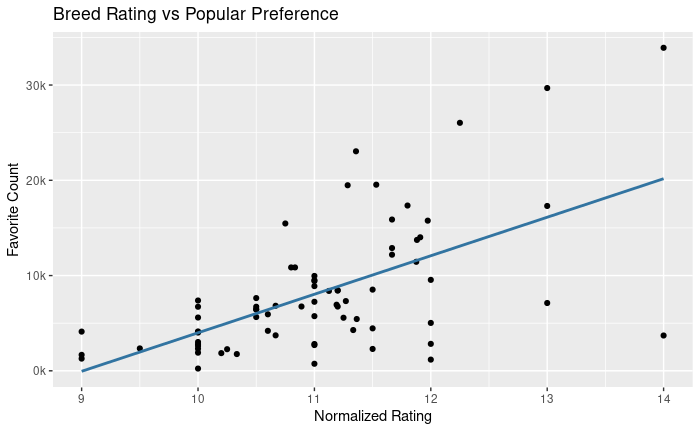

# Wrangling Project

## Description

The data wrangling process is made up of three stages—gathering, assessing, and
cleaning—each of which presents a unique challenge. This project entailed
working through the whole process, following it up with analysis.

See [wrap-up](https://raw.githack.com/fyasdani/wrangle-project/main/wrangle_report.pdf)
for a retrospective on the wrangling portion of the project.

## Dependencies

### [IPython Notebook](https://raw.githack.com/fyasdani/wrangle-project/main/wrangle_act.html)

- Python `3.9.18`
- `numpy` `1.24.3`
- `pandas` `2.0.3`
- `requests` `2.31.0`

They can be installed via `pip install <<package>>` if needed.

### [R Notebook](https://raw.githack.com/fyasdani/wrangle-project/main/wrangleR_act.html)

- R `4.3.1`
- `dplyr` `1.1.3`
- `ggplot2` `3.4.3`
- `jsonlite` `1.8.7`
- `knitr` `1.44`
- `lubridate` `1.9.2`
- `readr` `2.1.4`
- `scales` `1.2.1`
- `stringi` `1.7.12`
- `stringr` `1.5.0`
- `tibble` `3.2.1`
- `tidyr` `1.3.0`

They can be installed using `install.packages("package")` within an R
environment.

## Summary of [Findings](https://rawcdn.githack.com/fyasdani/wrangle-project/c8c0d3bf4139bc26396b02c045eb0d3ee9fafab9/act_report.html)

1. The `rating_denominator` is $10 \times n$, where $n$ is the number of dogs.

    1.1. Normalized and stripped of outliers, the mean rating is 10.9 out of 10.

2. The neural network is not very confident in its dog breed predictions.

3. Being a unique breed appears to give a ratings boost.

4. The ratings correlate quite well with popular preference.

